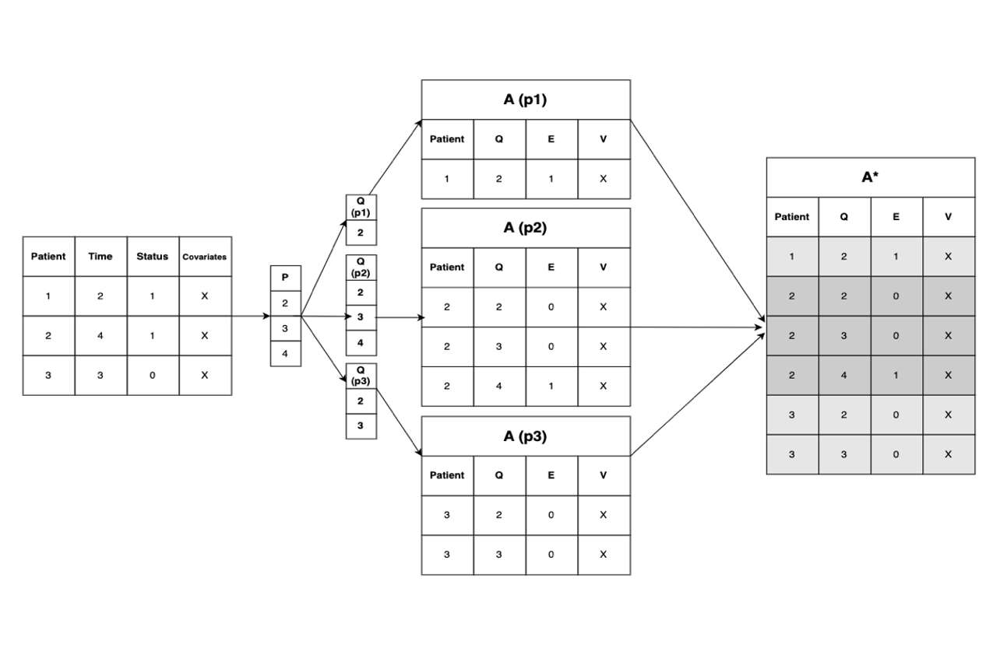

#### Transformation
To accomplish this task data typically includes: 
- Event Status ($E$)
- Event Time ($T$)
- covariates ($X$).

With the model $O$ given by:
$$ O = (E,T,X) $$

and $O_n$ being a sample of $O$ of size $n$ with a corresponding single observation described as: 

$$ o_i = (e_i, t_i, x_i) $$

To obtain the series of discrete-time intervals, the data requires a transformation of each single observation $o_i$ into a set of observations $o_{i,1}...o_{i,j}$, 

where $1...j$ indexes the ordered set of unique values from $T_n$ defined as $T_{unique}$ and $j$ is the index of $T_{unique}$ where $T_{unique} = t_i$ for each observation. 

With the transformation of $o_i$:
- the values of $t_{i,1} ...t_{i,j}$ are set to the values of $T_{unique}$ at indexes $1...j$ 
- the values of $e_{i,1} ... e_{i,j-1}$ are set to 0 
- the value of $e_{i,j}$ is set to the  value of $e_i$
- the values of $x_{i,1} ... x_{i,j}$ is set to $x_i$ 

The resulting dataset is then:

$$o_{1,1} ... o_{1,j} ... o_{i,1}...o_{i,j}$$

The figure below provides an example of the dataset transformation.

Using discrete-time intervals provides a convenient approach to flexibly model the latent probability of event as a probit transformed, non-parametric function of the distinct time interval and a set of covariates. 

s involves modeling the survival probability at time given
 $S(t)$ at ti$P(T > t|)$ of an observation ove

